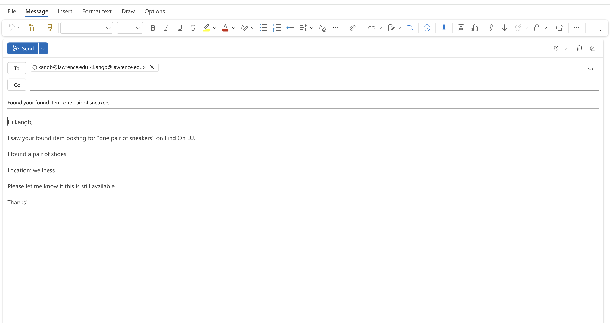
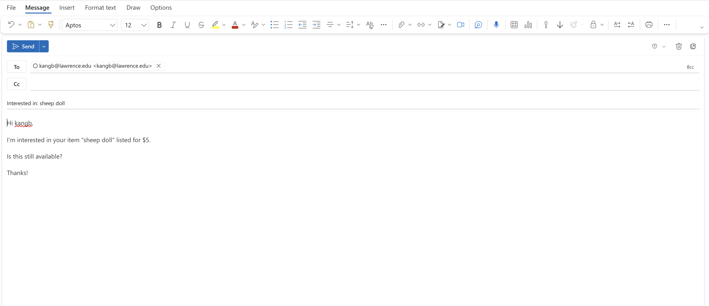

# Find On LU

Find On LU is a full-stack web app I built for Lawrence University students to:
- report lost and found items
- buy and sell secondhand items
- contact posters quickly from desktop or mobile

🌐 Live Demo: https://find-on-lu.vercel.app/dashboard  
📽️ Presentation: [View Slides](./slides/find-on-lu-slides.pdf)

---

## Overview

I started this project because students were posting in scattered places (group chats, random posts, word of mouth), which made both lost-item recovery and student selling inefficient.
Find On LU brings those workflows together, adds AI match suggestions for lost/found, and keeps contact simple with a hybrid flow (Outlook prefilled on desktop, fallback send on mobile).

---

## Current Features

- Lost & Found posting with optional image upload
- Thrift listing and browsing
- My Posts page with edit/delete controls
- Lost item status tracking (`active` / `reunited`)
- Password reset flow (`/reset-password`)
- AI-assisted matching for found items against lost items
- Match notification emails with confidence labels
- Hybrid contact flow (desktop prefilled compose + mobile fallback send)

---

## Architecture (Quick View)

- **Frontend (`src/`)**: React pages/components for UI and user actions
- **Data/Auth (`Supabase`)**: stores users, posts, and uploaded images
- **Serverless APIs (`api/`)**:
  - `generate-embedding.js` creates embeddings for lost items
  - `match-items.js` runs similarity matching and sends match notifications
  - `send-email.js` sends transactional emails through Resend

---

## Tech Stack

- Frontend: React, TypeScript, Tailwind CSS
- Backend/Data: Supabase, PostgreSQL
- AI: OpenAI embeddings + image analysis
- Email: Resend
- Deployment: Vercel

---

## Run Locally

```bash
npm install
npm start
```

### Required Environment Variables

Client:
- `REACT_APP_SUPABASE_URL`
- `REACT_APP_SUPABASE_ANON_KEY`

Server/API:
- `OPENAI_API_KEY`
- `SUPABASE_URL`
- `SUPABASE_ANON_KEY`
- `RESEND_API_KEY`
- `RESEND_FROM_EMAIL`
- `SUPPORT_EMAIL`

Notes:
- Some API files also support `REACT_APP_*` fallbacks for Supabase/OpenAI variables.
- In Vercel, environment variables must be set at the **project** level.

---

## Security Notes

- API routes require Bearer auth for protected operations.
- App authentication runs through Supabase Auth.
- Owner-level edit/delete protection depends on Supabase RLS policies.
- AI matching is a suggestion, not proof of ownership.

---

## Known Limitations

- Outlook prefilled compose can be inconsistent on some mobile app/browser combinations, so a mobile fallback send flow is included.
- No full admin moderation dashboard yet.
- Automated end-to-end test coverage is still limited.

---

## Future Improvements


- Admin moderation tools
- Improved analytics for matching quality
- Multi-campus support

---

## Screenshots

### Sign In


### Dashboard


### Lost & Found





### Marketplace





### My Posts


