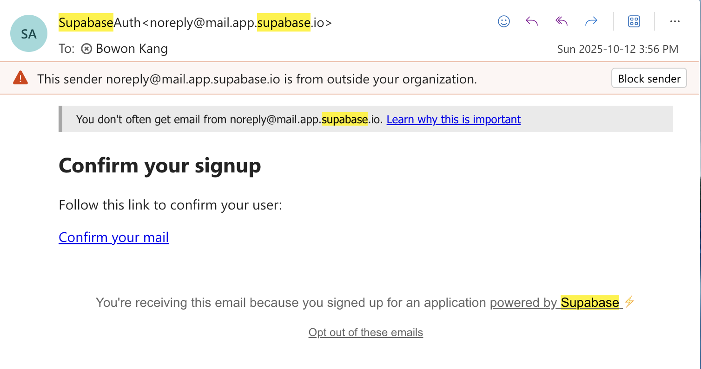
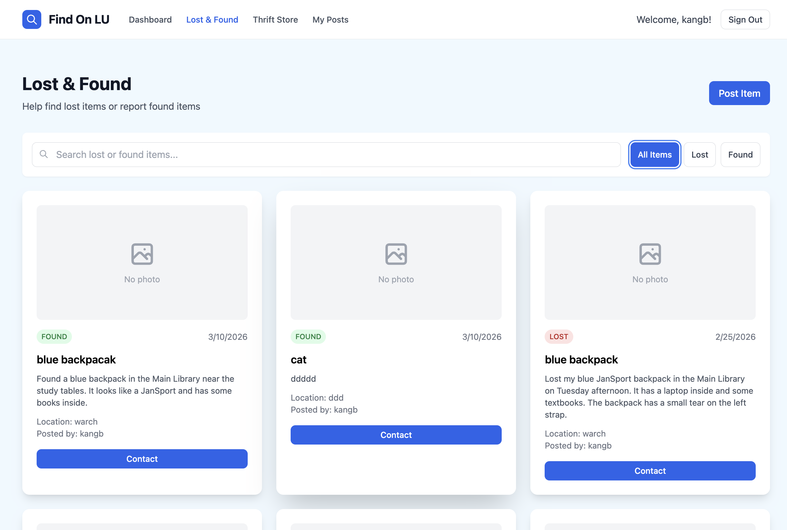
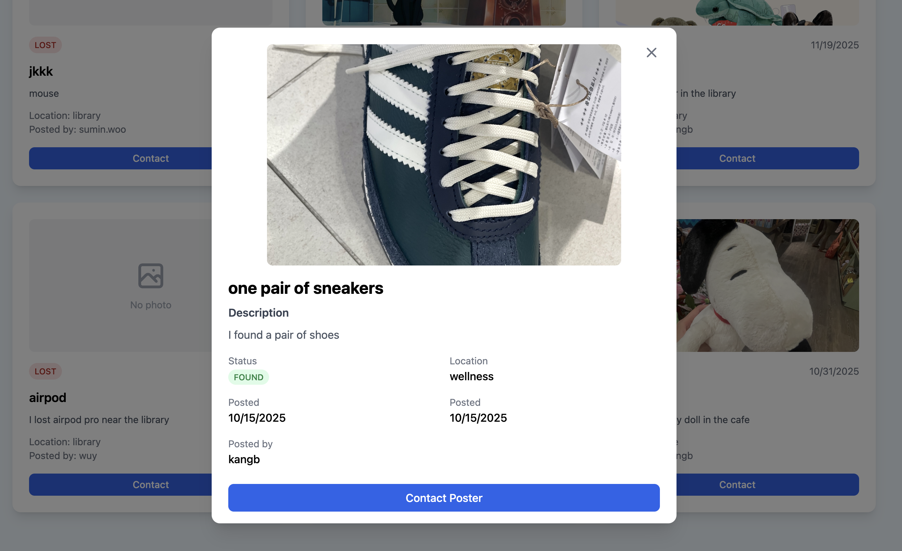
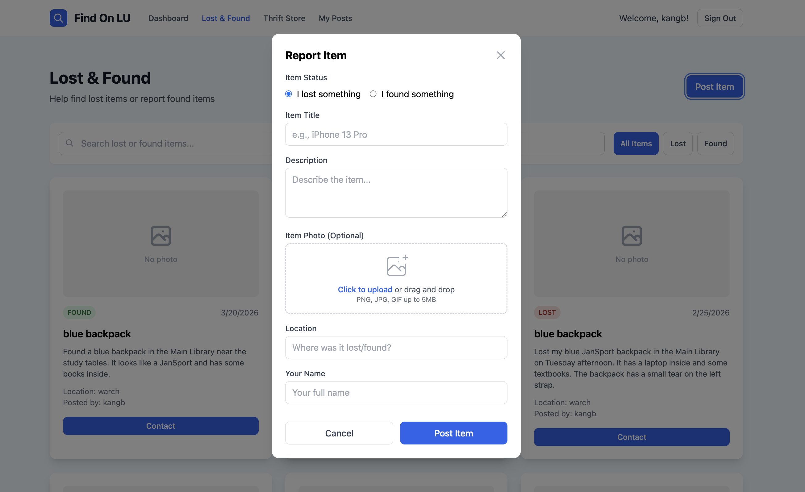
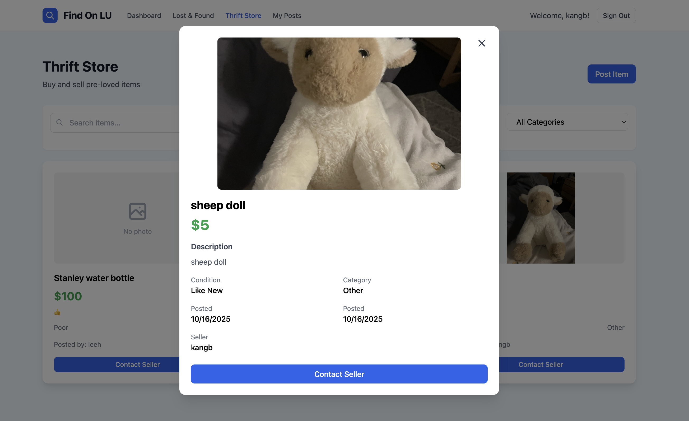
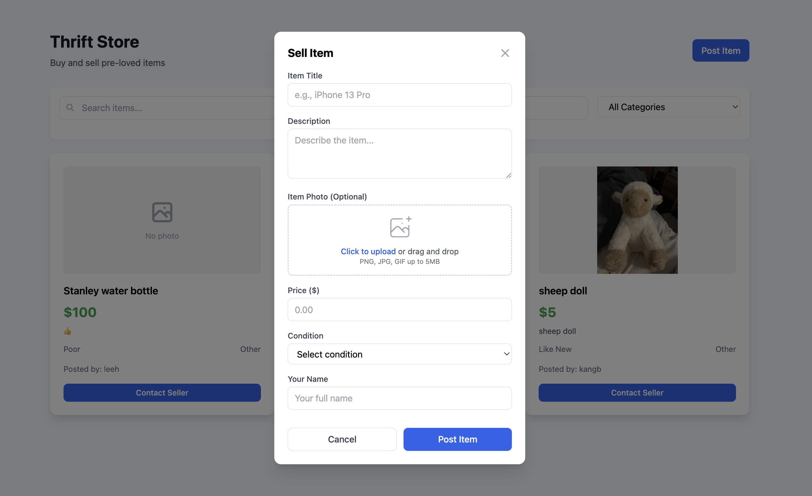
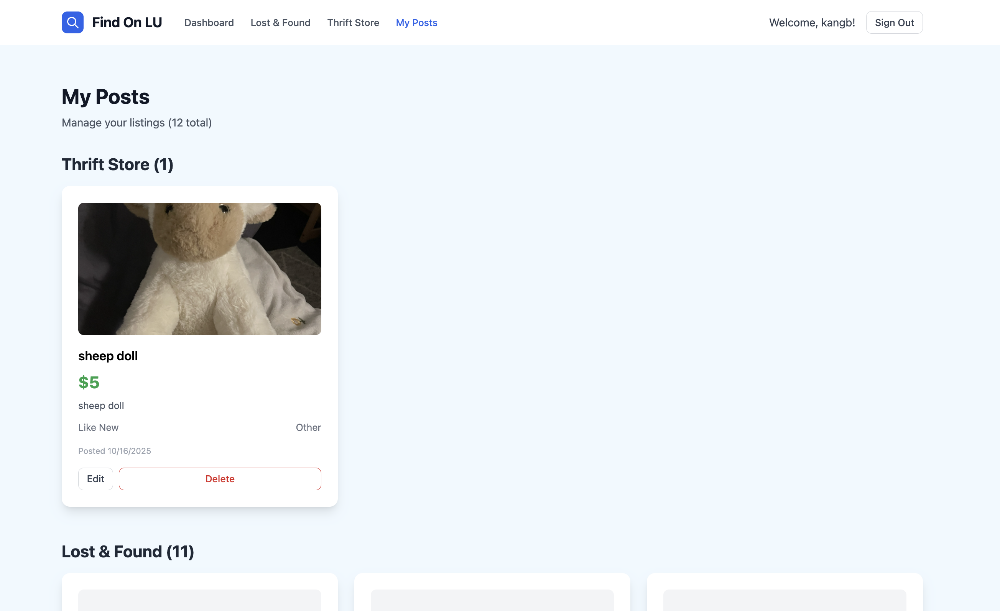
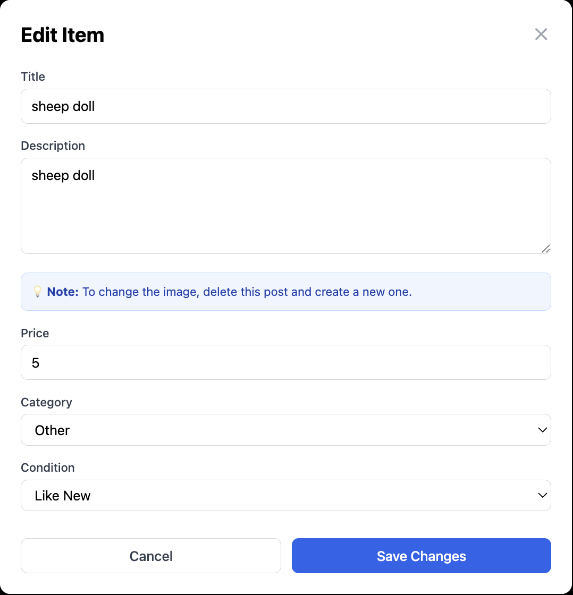

# Find On LU

A full-stack campus platform for Lawrence University students to report lost & found items and buy/sell secondhand goods.

🌐 Live Demo: https://find-on-lu-j0xaan8jw-bowonkang1s-projects.vercel.app
📽️ Presentation: [View Slides](./slides/find-on-lu-slides.pdf)

---

## Overview
Find On LU simplifies how students recover lost items and participate in a campus marketplace.
It provides a centralized platform for posting lost/found items and trading secondhand goods within the community.

---

## Features
- Lost & Found reporting with image uploads
- Campus marketplace (buy/sell items)
- Email authentication using @lawrence.edu
- Organized dashboard for managing posts
- Clean and responsive UI

---

## Tech Stack
- Frontend: React, TypeScript, Tailwind CSS
- Backend: Supabase, PostgreSQL
- Deployment: Vercel

---

## Key Highlights
- Built a full-stack application with authentication and database integration
- Designed a campus-only access system using email verification
- Deployed production-ready app with Supabase + Vercel

---

## Motivation
On campus, lost items are difficult to recover and there is no unified marketplace.
Find On LU solves both problems in a single platform.

---

## Future Improvements
- Real-time chat between users
- Notifications (email / push)
- Image recognition for item matching
- Mobile app version
- Multi-campus support

## Screenshots

###  Sign In

###  Dashboard

### Lost & Found

###  Marketplace

###  My Post

